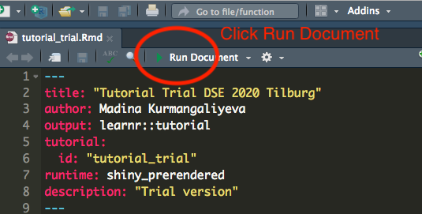

# Tutorial: Post-lasso and Post-double-selection inference

There are two ways of running this tutorial:

1. On your own computer (preferred).
2. Experimentally, on the cloud at [https://madinak.shinyapps.io/tutorial_postselection/](https://madinak.shinyapps.io/tutorial_postselection/) , **available for a limited time: from March 20 until Friday evening, March 26**.

I __strongly recommend__ the first option, meaning that you download the tutorial from [https://github.com/madina-k/DSE2021_tutorials/tree/main/tutorial_postselection](https://github.com/madina-k/DSE2021_tutorials/tree/main/tutorial_postselection) and __run a local version__ of the tutorial on your own computer. 

There are several reasons why running this tutorial locally is preferred:

1. Your progress with the tutorial will be saved locally on your own computer, so you can be sure that you can see your solutions and continue the work whenever you want. The online version also caches the progress but within your browser, so as long as you work from the same browser, it might still be ok. 
2. Learning to run code on your own machine is an important skill for a data scientist :D
3. I am experimenting with running these tutorials on the cloud for the first time. I don't know how well the server will handle simultaneous use by different people. I expect it should be ok, but cannot guarantee it. 
4. For this reason, the tutorial on the cloud **will be available online only until Friday evening, each week**. During the weekend, a new tutorial will be posted online and **the previous tutorial will  no longer be available**. 

## How to run an interactive tutorial locally from your computer

**Step 1.** Download this folder: [https://github.com/madina-k/DSE2021_tutorials/tree/main/tutorial_postselection](https://github.com/madina-k/DSE2021_tutorials/tree/main/tutorial_postselection)

**Step 2.** Open R Studio and install the following packages for this week's tutorial:

```r
install.packages(c("tidyverse", "learnr", "glmnet", "hdm", "broom"))
```
**Step 3.** Open the tutorial's Rmd file `tutorial_postselection.Rmd` in R Studio and click the green button "Run Document" at the top




Or if you do not see the button, run the following command within R Studio: 

```r 
rmarkdown::run("thefolderwhereyousavedthetutorial/tutorial_postselection.Rmd")

```
**Step 4.** Work with the compiled tutorial.  The  new subsections are slowly revealed to you once you hit  `continue` button. You get the correct answers for each quiz after you submit an answer first. You can get the **correct answer** to any coding question, by clicking **"hint"** button at the top panel of the coding chunk.

